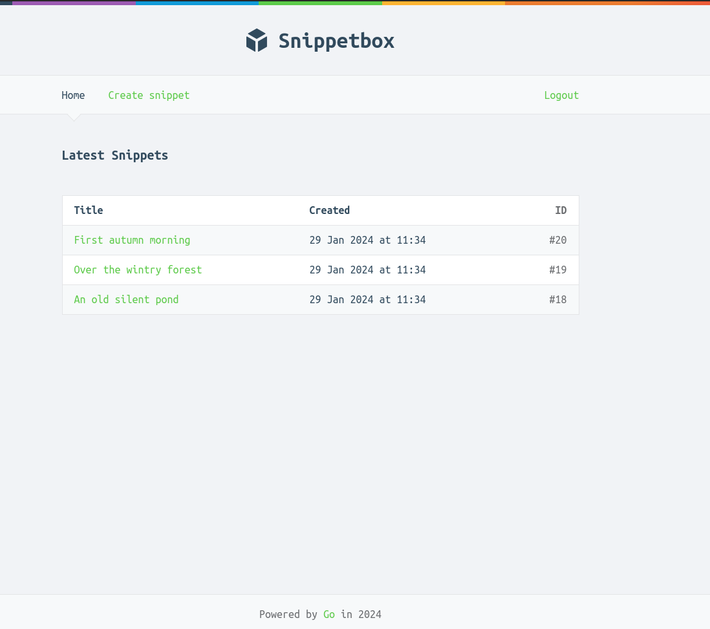
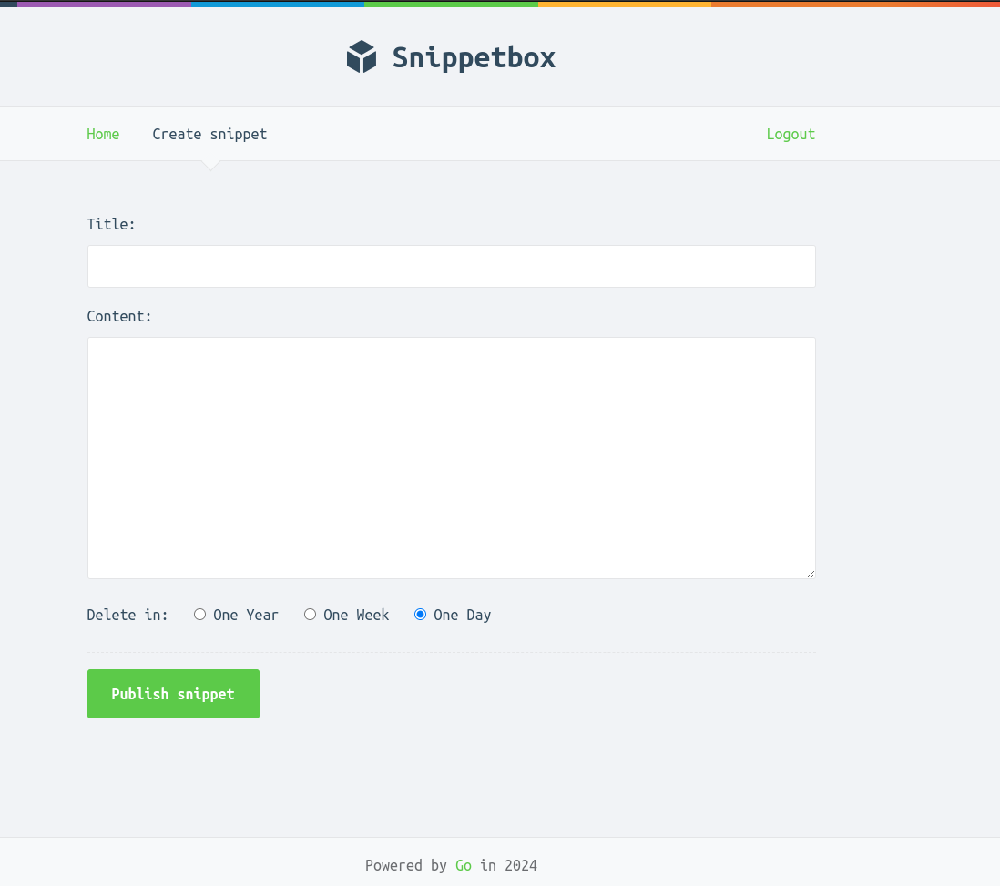
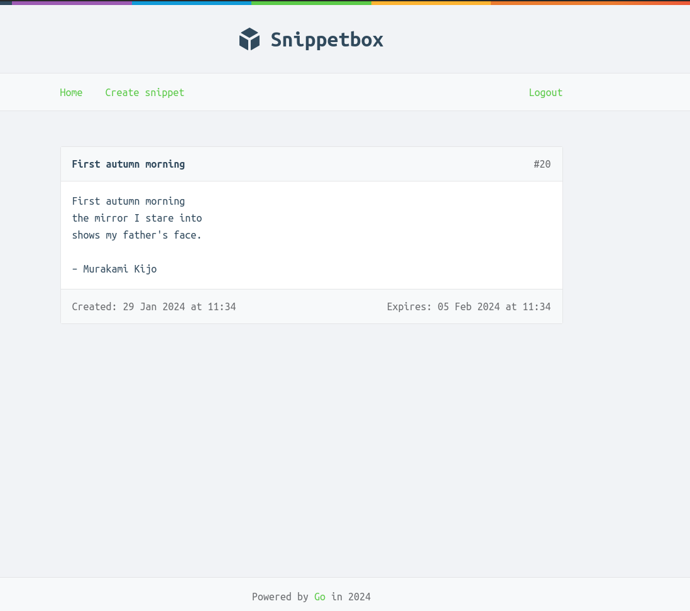
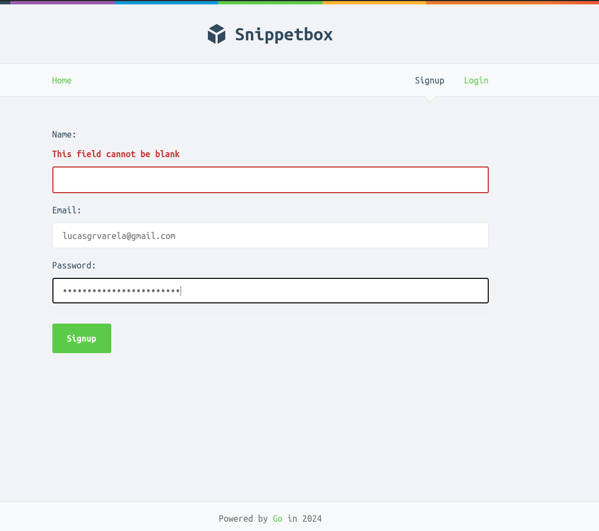

# Snippetbox

It's a web application which lets people paste and share snippets of text — a bit like Pastebin or GitHub’s Gists.

Based on the awesome [Let's Go book from Alex Edwards](https://lets-go.alexedwards.net)

### Home Page

### Snippet creation example

### Snippet example

### Signup form with validation
